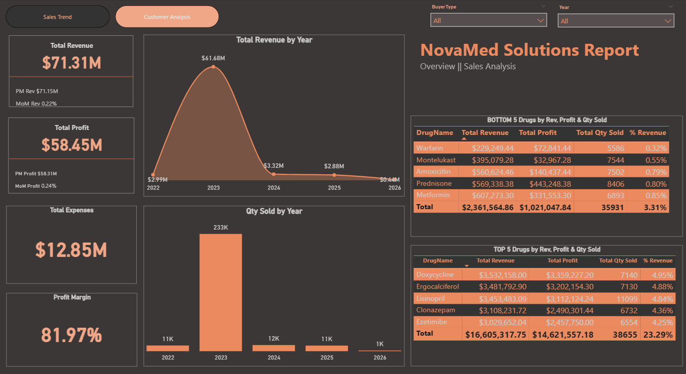

<!--Section 1: Introduce your self-->
## ABOUT ME

Hello! I'm Lydia Donkor, an insight-driven and detail-oriented Data Analyst with a strong foundation in data handling, reporting, and visualization. I bring a unique blend of analytical skills and business operations experience, with a proven ability to turn raw data into meaningful insights that support strategic decision-making.

<!--Mention your top/relevant skills here - core and soft skills-->
## WHAT I'M GREAT AT

- ✅ Data Cleaning 
- ✅ Data Storytelling
- ✅ Data Visualisation
- ✅ Problem Solving 

 I take great enthusiasm in uncovering patterns, solving problems, and presenting data in a clear, actionable way.

<!--Section 2: List 3-4 key projects-->
## MY PROJECTS

*A glimpse of some of the projects I've been working on.*

**This report analyses the performance of a cafe using Microsoft Excel and it answers key business questions such as the best performing menu item and the customer profile that spends the most**

<a href="Cafe Harmony Report.pdf">Download the full report here (pdf file)</a>

**A pharmaceutical company's analysis using Power BI. This project focuses on the sales and customer performance analysis evaluating the sales trend, customer demographics and revenue distribution.**

<a href="NovaMed Solutions Project.pdf">Download the full report here (pdf file)</a>

**Predictive Modeling and Hypothesis Testing using Titanic Dataset.**

Unfortunately, there weren’t enough lifeboats for everyone onboard, resulting in the death of 1502 out of 2224 passengers and crew. 

<a href="17 How to Present Data to Executives by Anietie Etuk.pdf">Download the Report here (pdf file)</a>

## CONTACT DETAILS

*Let’s connect and see how we can make a difference together!*
<table>
  <tbody>
    <tr>
      <td>📧</td>
      <td><a href="mailto:anietieetuk@gmail.com">anietieetuk@gmail.com</a></td>
    </tr>
    <tr>
      <td>ğŸ“</td>
      <td>(234) 816-763-7212</td>
    </tr>
    <tr>
      <td>ğŸ“</td>
      <td>PH, Nigeria</td>
    </tr>
    <tr>
      <td>⬇️</td>
      <td><a href="https://etuk123456.github.io/portfolio1/docs/Profile.pdf">Download my CV</a></td>
    </tr>
    <tr>
      <td>🌐</td>
      <td><a href="https://linkedin.com/in/etukanietie">The things I do daily on LinkedIn</a></td>
    </tr>
    <tr>
      <td>📺</td>
      <td><a href="https://www.youtube.com/@LearnwithEtuk">Watch my tutorials on YouTube</a></td>
    </tr>
  </tbody>
</table>

   

